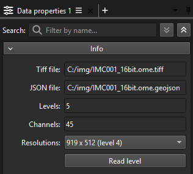
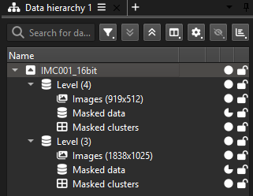
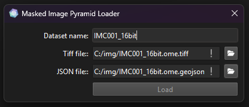

# Masked Image Pyramid Plugins

Data and loader for masked image pyramids for the [ManiVault](https://github.com/ManiVaultStudio/core) visual analytics framework.

```bash
git clone git@github.com:ManiVaultStudio/MaskedPyramidImages.git
```

This project handles one very specific scenario: Image pyramid stored in an [OME-TIFF](https://ome-model.readthedocs.io/en/stable/ome-tiff/) file accompanied by polygonal binary masks defined in a JSON file. 
A loader plugin reads one TIFF and JSON file and creates a MaskedPyramidData instance in ManiVault. Pyramid levels are read lazily, i.e. initially no level is read until explicitly requested.

## Repo structure
This repo provides the plugins `PyramidTiffData` and `PyramidTiffLoader` and uses [vcpkg](github.com/microsoft/vcpkg/) for setting up [LibTIFF](https://libtiff.gitlab.io/libtiff/).

```
├── CMakeLists.txt
├── README.md
├── vcpkg.json
├── PyramidTiffData/
├── PyramidTiffLoader/
└── test/
```

## PyramidTiffData

<p align="middle">
  
   
  </br>
  Interface for loading a selected level (left), two levels are loaded (right)
</p>

**Compression**: TIFF can be read if compressed with any of these standards: `NONE`, `LZW`, `DEFLATE`, `ADOBE_DEFLATE`, `ZSTD`, `PACKBITS`, `JPEG` (given that libtiff was compiled with the settings from the [vcpkg.json](./vcpkg.json)).

**Channel names**: Are recognized if saved in the `IMAGEDESCRIPTION` TIFF tag as standard in an OME-TIFF.

**Image masks**: 
- Are provided via corner points in the coordinate frame of the lowest image level and listed in a JSON file
- In ManiVault each mask is assigned a cluster which can be used for selection. Additionally, a point data set is derived from the image level that contains all masked pixel data
- Channel names are read from `["properties"]["name"]`
- If available, masks are assigned a color

JSON structure:
```JSON
{
  "type": "FeatureCollection",
  "features": [
    {
      "type": "Feature",
      "id": "some-unique-id-1233",
      "geometry": {
        "type": "Polygon",
        "coordinates": [
          [
            [
              10608,
              4665
            ],
            [
              10608,
              5665
            ],
            [
              11608,
              5665
            ],
            [
              11608,
              4665
            ],
            [
              10608,
              4665
            ]
          ]
        ]
      },
      "properties": {
        "objectType": "annotation",
        "name": "00A",
        "classification": {
          "name": "ROI",
          "color": [
            128,
            128,
            128
          ]
        },
        "isLocked": true
      }
    },
    [...]
  ]
}
```

## PyramidTiffLoader
<p align="middle">
  
</p>

If a JSON file with the same name as the selected TIFF file exists in the same folder, it will be recognized automatically.

Exemplary loading log:
```
OmeTiffPyramid: Found 1 series
------------------------------------------------------------
Series 0:
  Dimensions:  14711 x 8201 x 45 (Width x Height x Channels)
  Format:      16-bit uint
  Pyramid:     5 levels available
    [0]  14711 x   8201 | Scale:  1.00x | 45 IFDs
    [1]   7355 x   4100 | Scale:  0.50x | 45 SubIFDs
    [2]   3677 x   2050 | Scale:  0.25x | 45 SubIFDs
    [3]   1838 x   1025 | Scale:  0.12x | 45 SubIFDs
    [4]    919 x    512 | Scale:  0.06x | 45 SubIFDs
------------------------------------------------------------
PolygonData InformationImage Dimensions: 14711x8201
Total Polygons Detected: 31
Total Positive Pixels (across all polygons): 30896000

--- Polygon Details (5/31 shown) ---
  - Polygon 1: Name='16A', Pixels=1000000, Color=(128, 128, 128)
  - Polygon 2: Name='18B', Pixels=1000000, Color=(128, 128, 128)
  - Polygon 3: Name='21B', Pixels=1000000, Color=(128, 128, 128)
  - Polygon 4: Name='22C', Pixels=1000000, Color=(128, 128, 128)
  - Polygon 5: Name='15A', Pixels=1000000, Color=(128, 128, 128)
  ... 26 more polygons not shown.
------------------------------------------------------------
```

## Selection mapping

The `PyramidTiffData` plugins manages the mapping of selections between pyramid levels internally instead of relying on ManiVault's internal mapping mechanism.
This is necessary since we only lazily load pyramid levels and evaluate selection mappings on-the-fly. 
Selections in a level are first mapped to the base level first and from there to all other levels that have been loaded. 
<!-- 
ManiVault's current selection mapping does not allow this flexibily at the moment.
I tried to derive each level from an abstract base level, but that proved problematic.
-->
